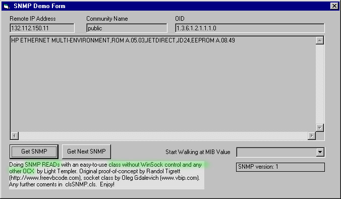



## A SNMP class without winsock control

### Description

SNMP class - Read SNMP values with a pure class without WinSock control or any other OCX.

Thx for hints and votes !

Light Templer (LiTe)

Keywords: SNMP, RFC 1157, "Simple Network Management Protocol", OID, class, network, admin, TCP/IP.
 
### More Info
 

             |
---                |---
**Submitted On**   |2004-02-11 19:01:12
**By**             |[Light Templer](https://github.com/Planet-Source-Code/PSCIndex/blob/master/ByAuthor/light-templer.md)
**Level**          |Advanced
**User Rating**    |4.7 (66 globes from 14 users)
**Compatibility**  |VB 5\.0, VB 6\.0
**Category**       |[Internet/ HTML](https://github.com/Planet-Source-Code/PSCIndex/blob/master/ByCategory/internet-html__1-34.md)
**World**          |[Visual Basic](https://github.com/Planet-Source-Code/PSCIndex/blob/master/ByWorld/visual-basic.md)
**Archive File**   |[VB\+\+\_\_\_\_A\_1707712122004\.zip](https://github.com/Planet-Source-Code/light-templer-a-snmp-class-without-winsock-control__1-51695/archive/master.zip)

